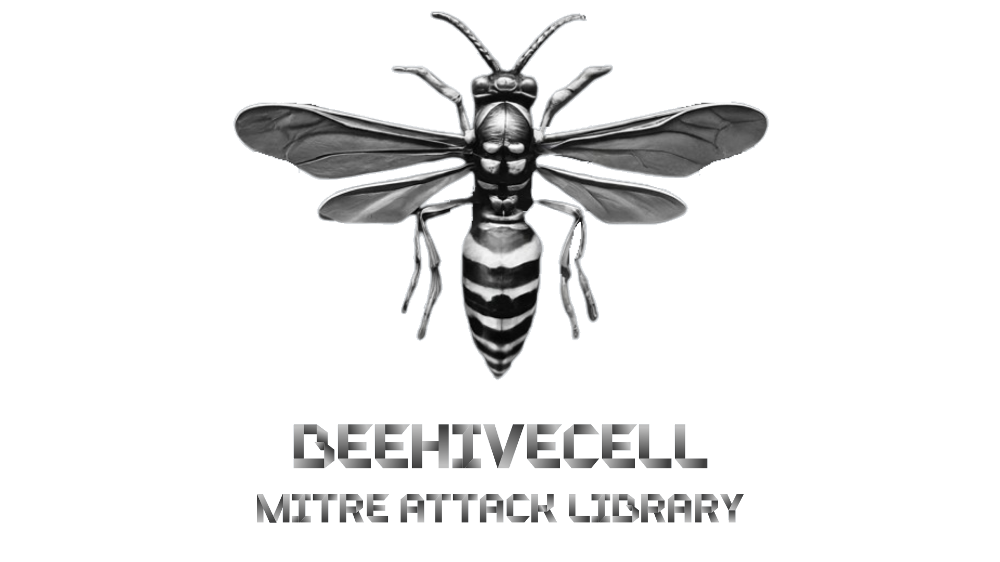

The Gladyator Arena Turn Back!

The gates of the arena have opened for the bravest warriors of cybersecurity! BEEHIVECELL is the ultimate battleground for those who want to explore MITRE ATT&CK techniques, challenge their rivals, and master the art of threat hunting. Here, researchers join forces, test their skills, and wield the sharpest weapons of cyber warfare. Define your strategy, build your team, and claim your place among the digital gladiators!

BEEHIVECELL is a project that aims to provide information and resources to researchers who want to specialize in the field of cyber security in order to increase awareness of malware. In accomplishing this goal, it offers users a passionate experience.

<h1>Social medias</h1>

<ul>
    <li><a href="https://www.linkedin.com/in/beehivecell/">LinkedIn</a></li>
    <li><a href="https://www.instagram.com/beehivecell">Instagram</a></li>
    <li><a href="https://github.com/beehivecell">Github</a></li>
</ul>
6df414cd-25e4-11f0-b03d-80fa5b7fd877.com
 
